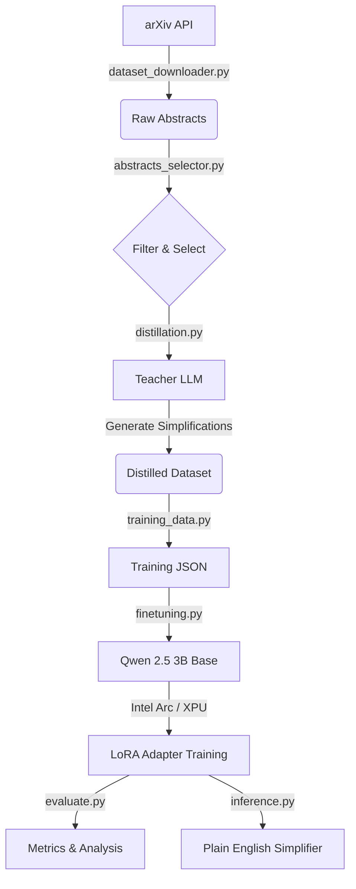

# UnArxiv 🔓
> **Making science accessible, one abstract at a time.**

<p align="center">
  
  
  
</p>

## The Problem
Ever tried reading a research paper and felt like you hit a wall of academic jargon? You're not alone. Scientific abstracts are often written *by* experts *for* experts, leaving everyone else behind. 

**UnArxiv** changes that. 

We've built a specialized AI model that takes dense, complex academic text and translates it into clear, plain English. It doesn't just cut words—it explains concepts using everyday analogies, turning graduate-level physics into something a 6th grader can understand.

---

## ⚡ The Tech Stack (Local & Mighty)
What makes this project special isn't just *what* it does, but *how* it runs. In a world dominated by CUDA, UnArxiv proves you don't need an Nvidia H100 to do serious AI work.

- **Hardware**: Runs entirely locally on **Intel Arc GPUs**.
- **Engine**: Finetuned **Qwen 2.5 3B** model (Instruct version).
- **Optimization**: Uses **PyTorch XPU** backend + **LoRA** (Low-Rank Adaptation) to train efficiently on just 8GB VRAM.

## 📊 Does It Actually Work?
Yes, and we have the numbers to prove it. We evaluated our model against the original abstracts using standard readability metrics.

| Metric | Original Abstract | UnArxiv Output | The Transformation |
|--------|------------------|----------------|-------------------|
| **Flesch Reading Ease** | 26.1 (Very Difficult) | **75.0 (Plain English)** | 🚀 **+48.9 points** |
| **Grade Level** | 15.5 (Graduate School) | **6.4 (6th Grade)** | 📉 **-9.1 grades** |
| **Word Count** | 142 words | **117 words** | ✂️ **17% more concise** |

> *"Imagine a crystal as a big box filled with tiny balls..."* 
> — Actual output from UnArxiv explaining structural phase transitions.

---

## 🏗️ Inside the Architecture
Here is how the pipeline flows, from raw data to a working model:



### The Codebase Structure
- **`model/`**: Where the magic lives. Contains the finetuned LoRA adapter (`qwen-arxiv-simplified-arc`).
- **`steps/`**: Modular scripts for every stage of the pipeline:
  - `distillation.py`: Uses a larger "teacher" model to create high-quality training examples.
  - `finetuning.py`: The training logic, explicitly optimized for Intel XPU memory management.
- **`inference.py`**: The interface you'll use to simplify new abstracts.
- **`evaluate.py`**: A rigorous testing suite that calculates ROUGE scores and readability metrics.

---

## 🚀 Get Started

### Prerequisites
You'll need a machine with an Intel Arc GPU and Python 3.10+.

### Installation
```bash
# 1. Clone the repo
git clone https://github.com/yourusername/UnArxiv.git
cd UnArxiv

# 2. Install dependencies (including Intel PyTorch extensions)
pip install -r requirements.txt
```

### run It!

**Simplify an Abstract**
Want to see it in action? Run the inference script. It comes with a built-in test case, or you can import `simplify_arxiv` into your own code.
```bash
python inference.py
```

**Run the Evaluation Suite**
Generate the full report on model performance:
```bash
python evaluate.py --test-size 50
```

**Compare Base vs. Finetuned**
See exactly what the finetuning achieved by running the diagnostic comparison:
```bash
python test_models.py
```

---

## 🤝 Contributing
Found a way to squeeze more performance out of the Arc card? Have a better prompting strategy? PRs are welcome! 

## License
MIT License. Go wild.
